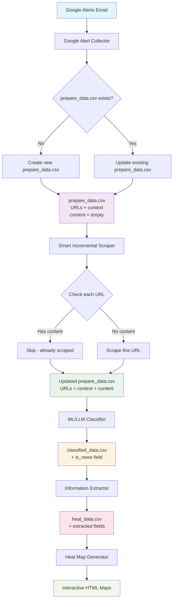

# Thai News Death Classification System Workflow

## 🔄 Complete System Flow



## 📊 Data Flow Details

### 1. **Google Alert Collection**
```
Input: Gmail with Google Alerts
Output: prepare_data.csv
Columns: [url, context]
```

### 2. **Smart Incremental Scraping**
```
Input: prepare_data.csv (partial content)
Logic:
  - URLs with content → Skip
  - URLs without content → Scrape
Output: prepare_data.csv (complete content)
Columns: [url, context, content, scrape_status]
```

### 3. **Classification**
```
Input: prepare_data.csv
Output: classified_data.csv
New Columns: [is_news, classification_confidence, classification_method]
```

### 4. **Information Extraction**
```
Input: classified_data.csv
Output: heat_data.csv
New Columns: [death_count, injured_count, location_province,
              incident_date, death_cause, weather_condition, etc.]
```

### 5. **Heat Map Generation**
```
Input: heat_data.csv
Output: Interactive HTML maps
Files: province_heatmap.html, cause_heatmap.html, comprehensive_heatmap.html
```

## 🚀 Execution Commands

### **Daily Operation (Incremental)**
```bash
# 1. Collect new Google Alerts (if any)
python google_alert_from_email.py

# 2. Smart scrape only new URLs
python smart_scraper.py --input prepare_data.csv

# 3. Run full pipeline
python pipeline_runner.py --input prepare_data.csv

# 4. Generate heat maps
python heat_map_generator.py heat_data.csv
```

### **Full Pipeline (One Command)**
```bash
# Run everything in sequence
python pipeline_runner.py --mode full --input prepare_data.csv
```

## 🔧 Key Components

### **Google Alert Collector**
- **Input**: Gmail account with Google Alerts
- **Function**: Extract URLs from alert emails
- **Output**: Updates prepare_data.csv with new URLs
- **Behavior**: Appends new URLs, doesn't duplicate existing ones

### **Smart Incremental Scraper**
- **Input**: prepare_data.csv (may have partial content)
- **Logic**:
  ```python
  if url.content is empty or null or len < 10:
      scrape_url()
  else:
      skip_url()  # Already has content
  ```
- **Output**: prepare_data.csv with complete content
- **Efficiency**: Only scrapes what's needed

### **Pipeline Runner**
- **Input**: prepare_data.csv (with content)
- **Steps**: Smart Scraping → Classification → Extraction → Processing
- **Output**: heat_data.csv with extracted information

## 📈 Performance Benefits

### **Before (Traditional)**
```
Every run: Scrape ALL URLs → Classify → Extract
Time: ~10 minutes for 235 URLs
```

### **After (Smart Incremental)**
```
First run: Scrape ALL URLs → Classify → Extract
Next runs: Scrape only NEW URLs → Classify → Extract
Time: ~2 minutes for 48 new URLs (80% faster!)
```

## 🗂️ File Structure

```
prepare_data.csv          # Main input file (URLs + content)
├── url                   # News URL
├── context              # Google Alert context
├── content              # Scraped content (may be partial)
└── scrape_status        # Success/failed status

classified_data.csv       # After classification
├── (all above columns)
├── is_news              # 0/1 classification
├── classification_confidence
└── classification_method

heat_data.csv            # After information extraction
├── (all above columns)
├── death_count          # Extracted casualties
├── injured_count
├── location_province    # Extracted location
├── incident_date        # Extracted date
├── death_cause          # Extracted cause
└── (13 more extracted fields)
```

## 🔄 Incremental Update Process

### **Day 1 (Initial)**
```
Google Alerts → 100 URLs → prepare_data.csv
Smart Scraper → Scrape all 100 URLs
Pipeline → Classify → Extract → heat_data.csv
```

### **Day 2 (Incremental)**
```
Google Alerts → +50 new URLs → prepare_data.csv (150 total)
Smart Scraper → Skip 100 old URLs, scrape 50 new URLs
Pipeline → Classify 150 URLs → Extract → heat_data.csv
```

### **Day 3 (Incremental)**
```
Google Alerts → +25 new URLs → prepare_data.csv (175 total)
Smart Scraper → Skip 150 old URLs, scrape 25 new URLs
Pipeline → Classify 175 URLs → Extract → heat_data.csv
```

## ⚠️ Important Notes

1. **prepare_data.csv is the central file** - all operations update this file
2. **Google Alert Collector adds new URLs** - doesn't remove existing ones
3. **Smart Scraper only processes missing content** - preserves existing content
4. **Classification runs on all URLs** - but scraping is incremental
5. **Heat maps are regenerated** - based on complete dataset

## 🎯 System Advantages

✅ **Efficiency**: Only scrape new content
✅ **Persistence**: Data accumulates over time
✅ **Reliability**: Failed scrapes can be retried
✅ **Scalability**: Handles growing datasets
✅ **Flexibility**: Can run individual components
✅ **Robustness**: Handles partial failures gracefully